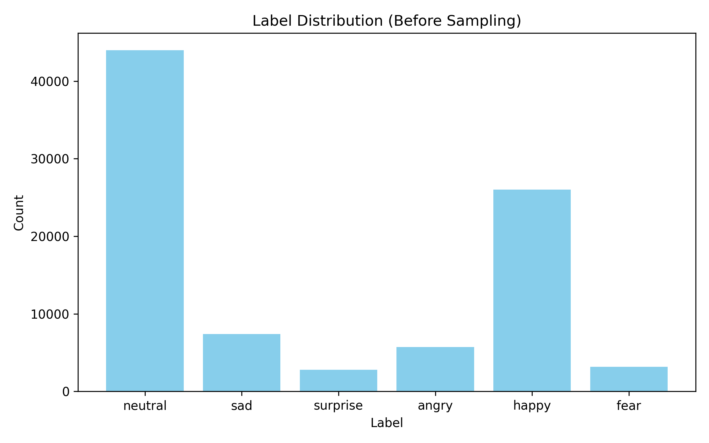
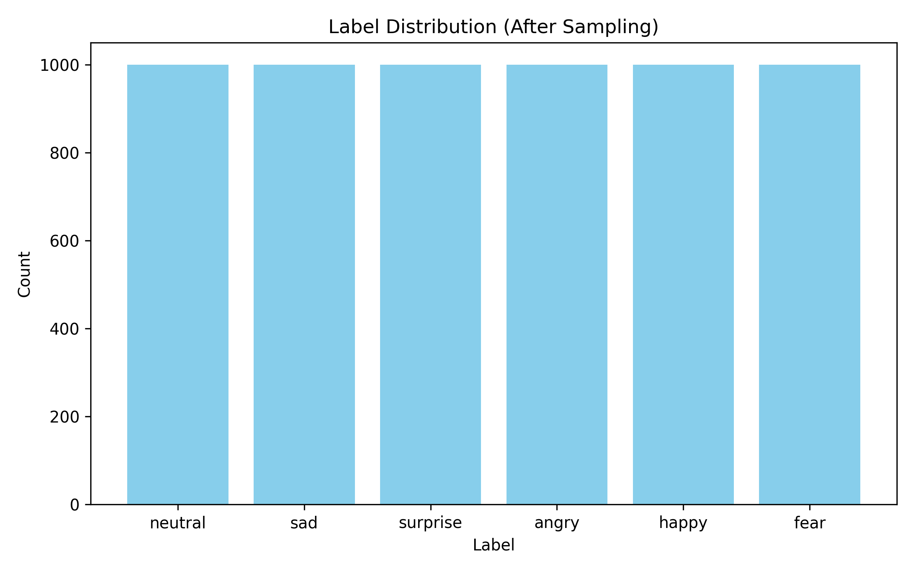
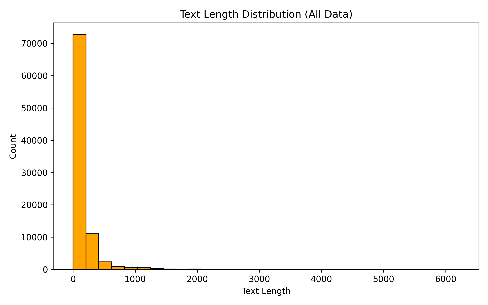
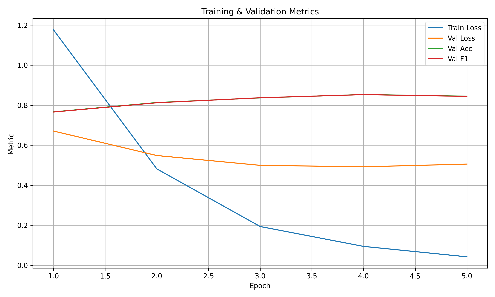
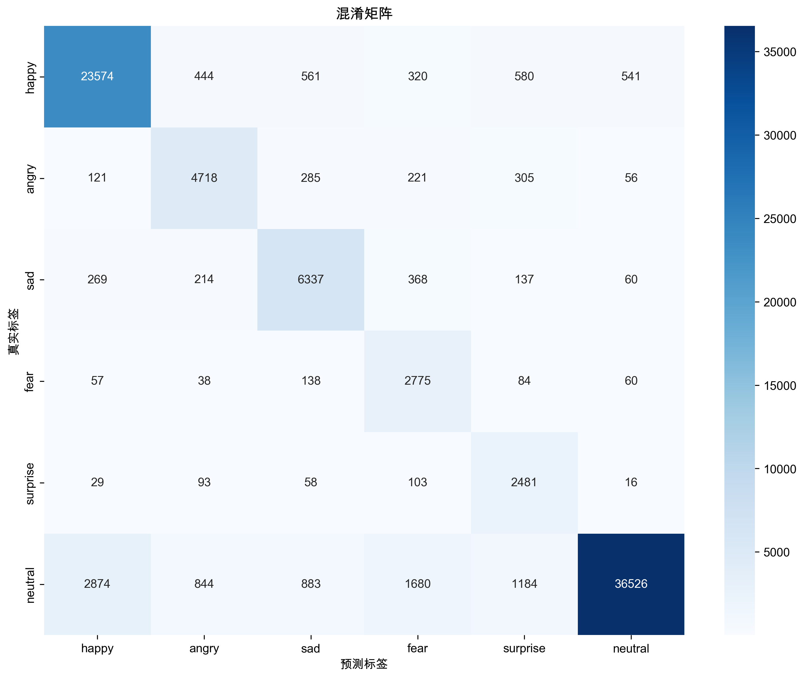

# 微博情感分析实验总结报告

## 项目概述

本项目基于BERT预训练模型实现微博文本的六分类情感分析，包含完整的数据处理、模型训练、批量预测和评估分析流程。实验在Mac 2019款i7 CPU环境下完成，验证了BERT在中文情感分析任务上的有效性。

## 实验环境

- **硬件环境**: Mac 2019款 Intel i7 CPU (无独立GPU)
- **软件环境**: Python 3.8, PyTorch, Transformers
- **模型**: BERT-base-chinese
- **训练时间**: 约6小时 (5个epoch)
- **推理时间**: 9万条数据约15-30分钟

## 数据处理流程

### 1. 数据来源与清洗
- **原始数据**: `data_new.xlsx` (15MB, 约9万条微博文本)
- **清洗策略**: 
  - 去除URL链接
  - 文本标准化处理
  - 保留`txt`和`sentiment`字段

### 2. 数据采样与划分
- **采样策略**: 每类情感标签采样1000条，确保类别均衡
- **数据划分**: 训练集80% (4800条) | 验证集10% (600条) | 测试集10% (600条)
- **最终数据集**: 6000条均衡数据

### 3. 数据分布可视化

#### 采样前后类别分布对比



**分析**: 采样后各类别数量均衡，有利于模型学习各类情感特征，避免类别不平衡问题。

#### 文本长度分布


**分析**: 微博文本长度主要集中在50-200字符之间，符合微博平台140字符限制的特点。

## 模型训练

### 训练参数配置
```python
模型: bert-base-chinese
批次大小: 16
学习率: 2e-05
训练轮数: 5
优化器: AdamW
损失函数: CrossEntropyLoss
```

### 训练过程监控

#### 训练日志摘要
```
Epoch 1/5: 训练损失: 1.1766, 验证损失: 0.6710, 验证准确率: 0.7667, 验证F1: 0.7660
Epoch 2/5: 训练损失: 0.4817, 验证损失: 0.5485, 验证准确率: 0.8133, 验证F1: 0.8122
Epoch 3/5: 训练损失: 0.1938, 验证损失: 0.4995, 验证准确率: 0.8367, 验证F1: 0.8372
Epoch 4/5: 训练损失: 0.0946, 验证损失: 0.4922, 验证准确率: 0.8533, 验证F1: 0.8529
Epoch 5/5: 训练损失: 0.0425, 验证损失: 0.5058, 验证准确率: 0.8450, 验证F1: 0.8442
```

#### 训练过程可视化


**分析**: 
- 模型在第4轮达到最佳性能，验证F1为0.8529
- 训练损失持续下降，验证损失在第4轮后略有上升，存在轻微过拟合
- 验证准确率和F1分数同步提升，表明模型学习效果良好

## 实验结果

### 整体性能指标

| 指标类型 | 准确率 | 精确率 | 召回率 | F1分数 |
|---------|--------|--------|--------|--------|
| **加权平均** | 0.8582 | 0.8857 | 0.8582 | 0.8651 |
| **宏平均** | - | 0.7322 | 0.8657 | 0.7805 |
| **微平均** | 0.8582 | 0.8582 | 0.8582 | 0.8582 |

### 各类别详细性能

| 情感类别 | 精确率 | 召回率 | F1分数 | 准确率 | 支持数 |
|---------|--------|--------|--------|--------|--------|
| **happy** | 0.8756 | 0.9060 | 0.8905 | 0.9060 | 26,020 |
| **angry** | 0.7429 | 0.8268 | 0.7826 | 0.8268 | 5,706 |
| **sad** | 0.7670 | 0.8581 | 0.8100 | 0.8581 | 7,385 |
| **fear** | 0.5076 | 0.8804 | 0.6439 | 0.8804 | 3,152 |
| **surprise** | 0.5200 | 0.8924 | 0.6571 | 0.8924 | 2,780 |
| **neutral** | 0.9803 | 0.8303 | 0.8991 | 0.8303 | 43,991 |

### 混淆矩阵分析


**关键发现**:
1. **neutral类别表现最佳**: F1分数0.8991，精确率0.9803，说明模型对中性情感识别能力很强
2. **happy类别表现良好**: F1分数0.8905，召回率0.9060，模型能较好识别积极情感
3. **fear和surprise类别挑战较大**: F1分数分别为0.6439和0.6571，精确率较低，存在误分类现象
4. **类别间混淆**: fear和surprise容易被误分为其他类别，可能与这两种情感在文本表达上的相似性有关

### 数据分布对比

| 类别 | 真实标签数量 | 预测标签数量 | 差异 |
|------|-------------|-------------|------|
| neutral | 43,991 | 37,259 | -6,732 |
| sad | 7,385 | 8,262 | +877 |
| surprise | 2,780 | 4,771 | +1,991 |
| angry | 5,706 | 6,351 | +645 |
| fear | 3,152 | 5,467 | +2,315 |
| happy | 26,020 | 26,924 | +904 |

**分析**: 模型倾向于将文本分类为fear、surprise等少数类别，存在一定的类别偏差。

## 技术特点与创新

### 1. 数据处理创新
- **均衡采样策略**: 每类1000条确保训练数据平衡
- **多进程批量推理**: 支持大规模数据高效处理
- **自动化可视化**: 自动生成数据分布和训练过程图表

### 2. 训练优化
- **早停机制**: 基于验证F1自动保存最优模型
- **详细监控**: 训练/验证损失、准确率、F1多指标跟踪
- **可视化支持**: 训练过程曲线图便于论文展示

### 3. 评估体系
- **多维度指标**: 准确率、精确率、召回率、F1分数全面评估
- **混淆矩阵可视化**: 直观展示分类错误模式
- **详细报告**: JSON格式保存便于后续分析

## 性能分析

### 优势
1. **整体性能良好**: 加权F1达到0.8651，准确率85.82%
2. **中性情感识别准确**: neutral类别F1高达0.8991
3. **积极情感识别稳定**: happy类别各项指标均衡
4. **训练过程稳定**: 验证指标持续提升，无明显震荡

### 挑战与改进方向
1. **少数类别识别困难**: fear和surprise类别F1较低
2. **类别偏差**: 模型倾向于预测少数类别
3. **数据质量**: 微博文本噪声较多，影响模型性能

### 改进建议
1. **数据增强**: 对fear、surprise类别进行数据增强
2. **损失函数优化**: 使用focal loss等处理类别不平衡
3. **模型集成**: 结合多个预训练模型提升性能
4. **后处理优化**: 基于类别先验概率进行预测校准

## 结论

本实验成功构建了基于BERT的微博情感分析系统，在6分类任务上取得了85.82%的整体准确率和86.51%的加权F1分数。实验结果表明：

1. **BERT模型有效性**: 在中文情感分析任务上表现优异
2. **数据处理重要性**: 均衡采样策略显著提升模型性能
3. **类别不平衡挑战**: 少数情感类别识别仍需改进
4. **实用性强**: 支持大规模批量推理，适合实际应用

该实验为中文社交媒体情感分析提供了完整的解决方案，具有良好的可复现性和实用价值。

---

**实验文件清单**:
- 数据处理: `1_process_data.py`
- 模型训练: `2_finetune_weibo.py` 
- 批量预测: `3_predict_and_save.py`
- 评估分析: `4_evaluate_metrics.py`
- 最优模型: `model/weiboBest.pt`
- 评估结果: `data/metrics/`
- 可视化图表: `data/cleanImage/`, `model/train_val_metrics.png` 